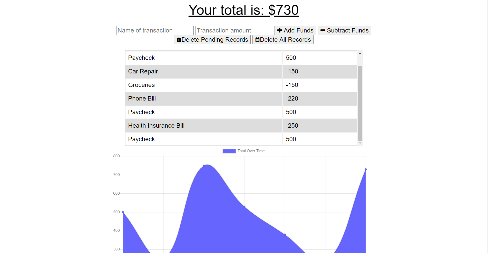

# Offline-Budget-Tracker

    <h4>
    </a>
    
    
        
    </h4>

 

  <h4>
    <a href="https://offline-pwa-budget-tracker.herokuapp.com/">
      Heroku Deployment
    </a>
     | 
    <a href="https://github.com/ThomasMullaney/Offline-Budget-Tracker">
      Github Repository
    </a>

  </h4>

## Description:
### A Budget tracker that allows you to add and subtract transactions. App is a PWA and should function without a connection.

## Table of Contents:
     
1. [Installation](#installation)
2. [Usage](#usage)
3. [License](#license)
4. [Contributing](#contributing)
5. [Tests](#tests)
6. [Questions](#questions) 

## Installation: 
### Created with mongoose, express, node, mongoDB. Clone the repo and npm install to use. 

## Usage:
### The user can post transactions even when offline. Users can either add or subtract funds and have them populate to a table and graph. Users can also delete pending transactions made offline, or delete all transactions within MongoDB.

## License:
### 
    
## Contributing:
### Tom Mullaney

## Tests:
### 

    
## Questions:
### github.com/ThomasMullaney
### tloring.mullaney
    
